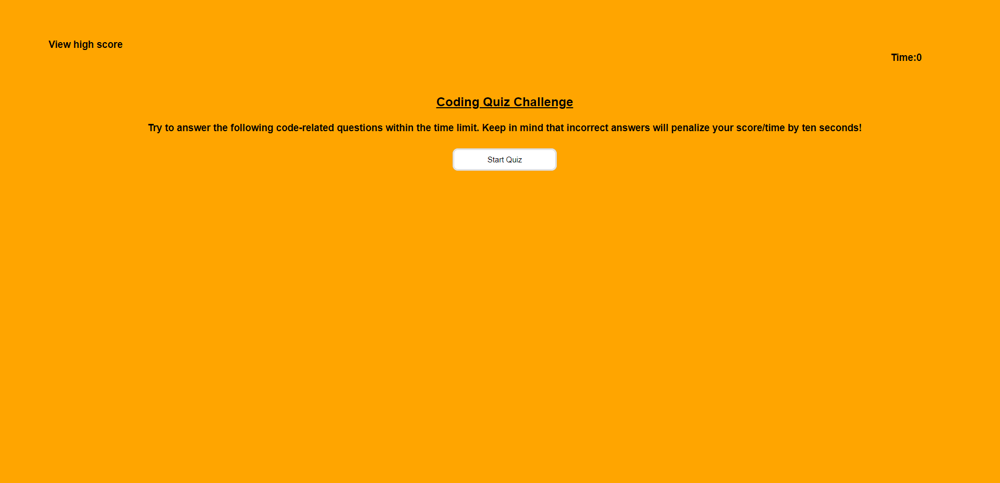

# Code-Quiz

## Purpose
This project consisited of creating a timed quiz with deduction of time if an answer is incorrect and being able to store the test scores. Doing this you will be able to see the scores of everyone else plus your own.

## Website
https://bryance97.github.io/Code-Quiz/

# Screenshot of my application

## Built With
* HTML
* CSS
* JavaScript

## Contribution
Made by Bryan Cifuentes-Escobar

#### ©️2021 Code Quiz